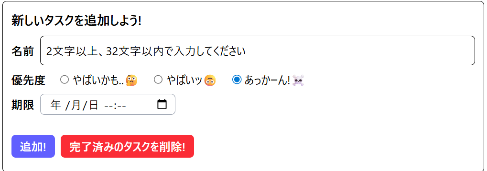
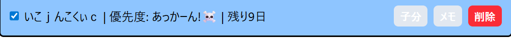
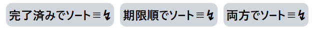
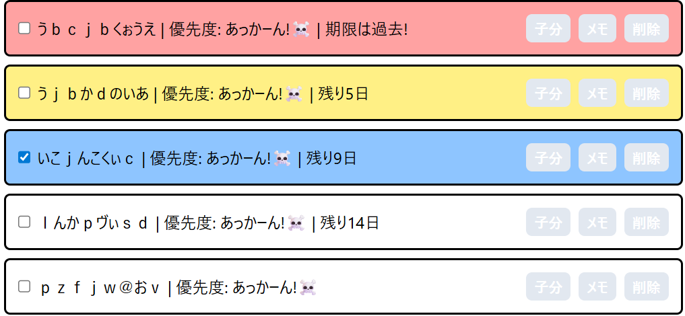
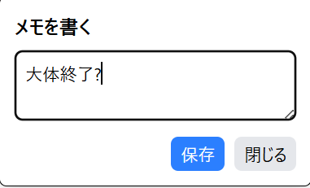
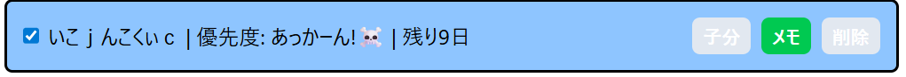
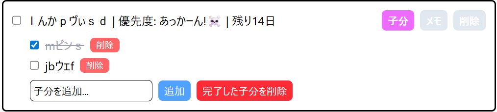
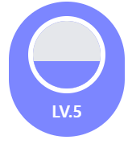

# やるべきことリスト

React、TypeScript、Tailwind CSS を使用し、ローカルストレージでデータを永続化した「Todoアプリ」です。

## 開発期間

- 2025年10月23日~2025年11月14日

## ライセンス

MIT License

Copyright (c) 2025  コツァ's lab

Permission is hereby granted, free of charge, to any person obtaining a copy
of this software and associated documentation files (the "Software"), to deal
in the Software without restriction, including without limitation the rights
to use, copy, modify, merge, publish, distribute, sublicense, and/or sell
copies of the Software, and to permit persons to whom the Software is
furnished to do so, subject to the following conditions:

The above copyright notice and this permission notice shall be included in all
copies or substantial portions of the Software.

THE SOFTWARE IS PROVIDED "AS IS", WITHOUT WARRANTY OF ANY KIND, EXPRESS OR
IMPLIED, INCLUDING BUT NOT LIMITED TO THE WARRANTIES OF MERCHANTABILITY,
FITNESS FOR A PARTICULAR PURPOSE AND NONINFRINGEMENT. IN NO EVENT SHALL THE
AUTHORS OR COPYRIGHT HOLDERS BE LIABLE FOR ANY CLAIM, DAMAGES OR OTHER
LIABILITY, WHETHER IN AN ACTION OF CONTRACT, TORT OR OTHERWISE, ARISING FROM,
OUT OF OR IN CONNECTION WITH THE SOFTWARE OR THE USE OR OTHER DEALINGS IN THE
SOFTWARE.

## 開発にかかった時間
約27時間ほど

## 「やるべきことリスト」のコンセプト
まずこの「やるべきことリスト」のコンセプトは、タスクをやりたいと思わせるということと、自分がこれは欲しいなと思った機能を全て実装することです。 まずやりたいと思わせるというコンセプトについては、私はタスクをやる時にいやいややってしまうタイプなので、アプリの方でやりたい思わせることができればいいなと思ったのでコンセプトにしました。 次に自分がこれは欲しいなと思った機能を全て実装するというコンセプトについては、私は普段、メモ帳などにやることを書きだしてやるべきことリストを作っていたのですが、その際にこれがあったら便利だな、あんな機能があったら捗るなと思うことがあったので、今回のアプリ作成ではそういった自分が欲しかった機能を全部実装しようと思ってコンセプトにしました。

## 「やるべきことリスト」の機能
　始めにtodoアプリとしての基本的な機能について説明します。 まず、下の「新しいタスクを追加しよう」にて「名前」「期限」「優先度」を設定して「追加!」ボタンを押すことでタスクを追加できます。「期限」に関しては設定しないことも可能です。 追加されたタスクの右にあるチェックボックスで完了しているかどうかを設定することが可能で、チェックがついているタスクは「追加!」ボタン横の「完了済みタスクを削除!」で一括削除できます。 
以下の画像は機能に関する写真です。 
 
 

　この次に紹介する機能は個々の削除機能です。 この機能は各タスクの右にある「削除ボタン」を押すことで、個々のタスクを削除することができる機能で、この機能を実装した理由は間違った期限などを設定してしまったときに個別に削除してやり直せたら便利だなと思ったので実装しました。  
以下の画像は機能に関する写真です。 
 
 

　3つ目に紹介する機能はソート機能です。 この機能は画面上部にある「完了済みでソート≡↯」「期限順でソート≡↯」「両方でソート≡↯」ボタンを押すことで、完了済みや期限またはその両方に基き、各タスクを並び替えることができます。 まず完了済みソートは完了済みのタスクが下になるようにソートします。 完了済みタスクを下にすることでやるべきことが分かりやすくなります。 次に期限ソートは上から期限が近い順にソートします。 期限が過ぎているタスクがある場合、そのタスクが一番上になります。 期限が近いタスクがどれか分かりやすくすることで、どれから取り組むかを考えやすくすることが可能です。 最後に両方ソートは、先に紹介した「完了済みソート」「期限ソート」の両方を同時に行うことができます。上から期限の近い順にソートし、完了済みのタスクは期限にかかわらず下にソートします。 このソートはやるべきことが必ず一番上に来るので一番使いやすいです。　この機能を実装した理由はやるべきことを明確にすることができたら便利だと思ったからです。 私はやることが多いと簡単なものからやってしまうことが多いので、期限などで優先順位が分かりやすくなればいいなと思ったので実装しました。 
以下の画像は機能に関する写真です。 
 
 

　4つ目に紹介する機能はタスクの状態による色分けです。 各タスクは「完了済み」なら青色、「期限が1週間以内」なら黄色、「期限が超過」していたなら赤色になります。この機能を実装した理由は一目でタスクの状態を確認出来たら便利だと思ったからです。 自分でやることべきリストを作っていた時は、文字のみで優先するべき状態や期限を書いていたのですが、いつも結局見るのをやめて楽なタスクから行っていたので、どのタスクをしなければならないか、どのタスクの期限が近いかを一目で分かるようになれば便利だと思ったので実装しました。 
以下の画像は機能に関する写真です。 
 
 

　5つ目に紹介する機能はメモです。 この機能は各タスクの「メモ」ボタンを押すことによって各タスクにメモを登録することができます。リロード、再読み込み時にメモを残しておきたかったら、「メモ」ボタンによって現れるメモウィンドウの「保存」ボタンを押すことでリロード、再読み込み時にメモを残すことができます。 この機能を実装した理由は、メモがあったらタスクの進捗を残すことができて便利だと思ったからです。 自分でやるべきことリストを作っている時に、私は忘れっぽいのでタスクの進捗や、困っている時の解決案などを適当なところに書いていましたが、これをタスクごとのメモとして実装出来たら便利だなと思ったので実装しました。 
以下の画像は機能に関する写真です。 
 
 

　6つ目に紹介する機能は「子分タスク」です。この機能は各タスクの「子分」ボタンをおすことで子分タスクを表示、追加、個別削除、完了済みを削除することができます。子分タスクは各タスクごとに追加でき、個別削除とチェックボックス機能のみを持っています。 下のメッセージボックスで名前を入力、「追加」ボタンで子分タスクを追加、「削除」ボタンで各タスクを個別削除することができます。　また、チェックボックスにチェックがついているタスクはまとめて下の「完了した子分を削除」ボタンで削除できます。 大体タスクの機能と同じです。 この機能を実装した理由はタスクの中身を細分化できれば便利だと思ったからです。私は自分でやるべきことリストを作っていた時に自分で子分タスクを作っていました、例えばtodoアプリを作るというタスクがあった時に子分として「タスク削除機能を実装する」や「メモ機能を実装する」という感じです。 これがアプリ自体に実装されていたら便利だと思ったのでこの機能を実装しました。 
以下の画像は機能に関する写真です。 
 
 

　7つ目に紹介する機能は「レベル」機能です。 これは完了済みのタスクを削除した時に経験値が蓄積されていき、レベルが上がっていくという機能です。今何レベルなのか、あとどれくらいでレベルが上がるのかは画面右上で確認できます。　
この機能を実装した理由はタスクをやりたいと思えるようになればいいなと思ったからです。 タスクを行うことで何か報酬を得ることができればタスクを行うモチベーションになると考えました。そう考えた時に私はゲームが好きなのでレベルが上がっていく形にすればモチベーションになるなと考えたのでこの機能を実装しました。 
以下の画像は機能に関する写真です。 
 
 

## 工夫した点、頑張った点
工夫した点、頑張った点1つ目は優先度の表し方です。 このアプリのユーザーがタスクを確認するときに「やらなきゃ」というストレスではなく、少し笑える「面白さ」を感じれるように、優先度の表し方を機械的な「1,2,3」や「低,中,高」ではなく、少し笑えるような「やばいかも..🤔,やばいッ🙃,あっかーん!☠」にしてみました。 
 
工夫した点、頑張った点2つ目はボタンなどを押すことで流れる音です。 何もないとボタンを押している実感が沸かないというのと、単純に私が寂しいと思ったのでボタンをクリックするときに対応した音が鳴るようにしました。 「タスク生成」「タスク削除」、「その他」で音を分けたことも工夫した点です。 「タスク生成」はタスクを生成するボタンのことです。これにはゲームのバフを賭けた時の様な音を鳴らし、「何かが生成された感」を演出しました。「タスク削除」はタスクを削除するボタンのことです。これには何かが消えたような音を鳴らすことで「何かが消えた感」を演出しました。「その他」は押すことでウィンドウが開くなどのボタンのことです。これにはボタンが押されたということを強く印象付けるために機械的な、いかにも「ボタンが押された」感じの音を流しました。 
 
工夫した点、頑張った点3つ目はアプリ全体で色が被らないようにしたことです。 このアプリではタスクの「追加」「削除」「メモ」「子分」やタスクの期限などで色分けを用いていますが、なるべく機能同士では違う色、同じような機能では似た色を使用しています。 例えば削除関係のボタンは赤、追加関係は青、そのほかでも似た色にならないように工夫しました。なぜこのようなことをしたのかというと、まず単純に見た目です。 色を多く使うことで見栄えが良くなると思ったので色を分けました。 次にボタンの位置を覚えやすくするためです。 ボタンの機能と色を紐づけることで、どこにどのボタンがあるか、そのボタンはどんな機能を持っているかを覚えやすくなるように工夫しました。 また、「期限超過」と「削除ボタン」で同じ赤色になっていますが、「削除」に関連づく色が赤以外しっくりこなかったのと「期限超過」に危機感を感じさせたいと考えたので、両方に赤色を採用しました。 しかし赤色の中でも彩度などを変えることでなるべく見やすいように工夫しました。 
 
工夫した点、頑張った点4つ目はレベルの表示の仕方です。 今回のアプリのレベル表示は、丸の色が白からどんどん青に染まっていき、最後まで染まるとレベルが上がるという風にしています。 また、タスクごとに設定している経験値もあえて見えないようにしています。 なぜこのようにしたのかというと、理由は2つあります。 まず1つ目はレベルを上げることが目的にならないようにするためです。タスクごとの経験値や、あとどれくらいでレベルが上がるかを明示してしまうと、タスクを行うことではなくレベルを上げることが目的になってしまい、レベルアップの効率のみを追い求めてしまう可能性があると思ったからです。 このアプリにおけるレベルはあくまでもタスクを行うモチベーションを向上させるものなので、あえて値を明示しないことで経験値が高いタスクのみを行うなどの行動を防ぐようにしました。  2つ目の理由はタスクを行うモチベーションを向上させるためです。 このアプリでは値を明示していないものの、○の色の染まり具合でおおよそあとどれくらいでレベルが上がるのか分かるようになっています。 これによってタスクを完了した時の成果を可視化し、モチベーションを向上させると考えました。 またあと少しでレベルが上がりそうというときに「もう少し頑張るか」という気持ちにもなり、モチベーションを向上させるとも思いました。

